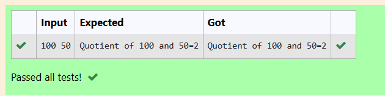

# EX1(A) DATATYPES-AND-OPERATORS
 ## AIM:
 To write a program to find sum and quotient of two integer numbers
 ## ALGORITHM:
 1.Start the program

 2.Assign 2 variable of datatype integer.

 3.Get input from the user.

 4.using sum opertor add both the variables to calculate the sum.
 
 5.Similarly Use '/' to find the quotient of the integers.

 5.Print the output.
 ## PROGRAM
 ### Program 1:
 ```
#include <stdio.h>
int main()
{
    int a,b;
    scanf("%d",&a);
    scanf("%d",&b);
    int sum=a+b;
    printf("Sum of %d and %d=%d",a,b,sum);
    return 0;
}
```
### Program 2:
```
#include <stdio.h>
int main()
{
    int a,b;
    scanf("%d",&a);
    scanf("%d",&b);
    int q;
    q=a/b;
    printf("Quotient of %d and %d=%d",a,b,q);
    return 0;
}
```

## OUTPUT:
### Outpu 1:


### Output 2:

## RESULT:
Thus the program to find sum and quotient of two numbers is executed successfully.