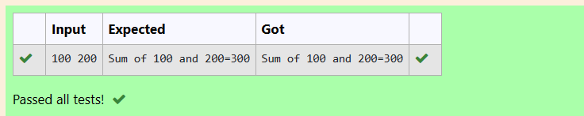

# EX1(A) DATATYPES-AND-OPERATORS
 ## AIM:
 To write a program to find sum of two integer numbers
 # ALGORITHM:
 1.Start the program

 2.Assign 2 variable of datatype integer.

 3.Get input from the user.

 4.using sum opertor add both the variables.

 5.Print the output.
 # PROGRAM
 ```
#include <stdio.h>
int main()
{
    int a,b;
    scanf("%d",&a);
    scanf("%d",&b);
    int sum=a+b;
    printf("Sum of %d and %d=%d",a,b,sum);
    return 0;
}
```
## OUTPUT:

## RESULT:
Thus the program to find sum of two numbers is executed successfully.